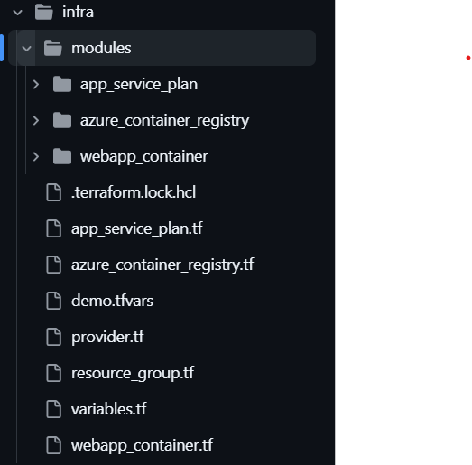
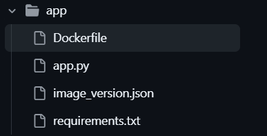

# 🚀 Flask Health Check App (Containerized)

A simple containerized Python Flask application with a Get Operation endpoint returns the status of the application, deployed to Azure WebApp via GitHub Actions. Infrastructure is provisioned in Azure using the Infrastructure as Code (IaC) tool terraform. Appluication code is developed in python flask and made the image out of docker. Docker image is being pulled from the Azure Contianer Registry (ACR) and deployed in Azure Web App Container. 

---

## 📦 Features

- ✅ Get endpoint returns status of the application ('/health')
- 🐳 Dockerized Flask application
- ☁️ Azure Web App for Containers deployment
- 🔐 Image pulled from Azure Container Registry (ACR)
- 🔁 CI/CD pipeline using GitHub Actions
- ⚙️ Infrastructure as Code using Terraform

---
## 🧱 Project Architecture

Above diagram shows the cloud infrastructure architetcure for the Health Check App. User from outside world will access the web app from the browser in HTTP port 80 and with the webapp URL(http://appdockerhealth.azurewebsites.net/health). The request will be then served by WebApp (appdockerhealth) which is residing in a Linux based App Service Plan. When ever the code change happens the container image will be built by the application workflow and the image is pushed to the Azure Container Registry(acrmidsanth1855) which is residing in the same resource group as that of WebApp Container. The same workflow will pull the image from the container registry and deploy the same in the WebApp Container.
## 🗂️ Repository Structure
Infrastrcture and Application code are kept in this same repository. Code is kept in separate folders for each area. The folder structure of the repo is as below.
- 📂infra 
   All the infrasture code (Terraform) is places in this folder with another subfolder modules where the Azure Resource Terraform modules are kept in another subfolders for each resources. 
   
- 📂app
  Application code for the health app is kept here along with the docker file and its dependent files. Also for tracking the docker imager version/tags another json file is kept.
  

## Configuration
### Infrastructure
### Application
### CI/CD 

## Benifits

## Scope of improvement
 - ASE
 - Vnet integration

