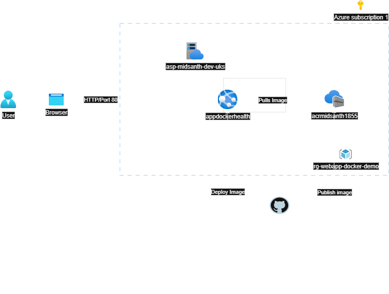
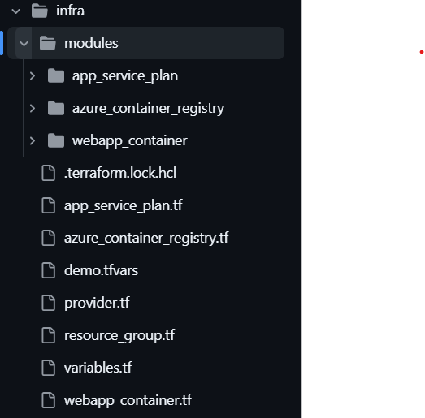
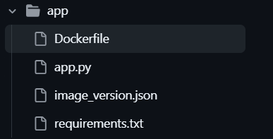

# 🚀 Flask Health Check App (Containerized)

A simple containerized Python Flask application with a Get Operation endpoint returns the status of the application, deployed to Azure WebApp via GitHub Actions. Infrastructure is provisioned in Azure using the Infrastructure as Code (IaC) tool terraform. Appluication code is developed in python flask and made the image out of docker. Docker image is being pulled from the Azure Contianer Registry (ACR) and deployed in Azure Web App Container. 

---

## 📦 Features

- ✅ Get endpoint returns status of the application ('/health')
- 🐳 Dockerized Flask application
- ☁️ Azure Web App for Containers deployment
- 🔐 Image pulled from Azure Container Registry (ACR)
- 🔁 CI/CD pipeline using GitHub Actions
- ⚙️ Infrastructure as Code using Terraform

---
## 🧱 Project Architecture
 

Above diagram shows the cloud infrastructure architetcure for the Health Check App. User from outside world will access the web app from the browser in HTTP port 80 and with the webapp URL(http://appdockerhealth.azurewebsites.net/health). The request will be then served by WebApp (appdockerhealth) which is residing in a Linux based App Service Plan. When ever the code change happens the container image will be built by the application workflow and the image is pushed to the Azure Container Registry(acrmidsanth1855) which is residing in the same resource group as that of WebApp Container. The same workflow will pull the image from the container registry and deploy the same in the WebApp Container.

----
## 🔩 Configuration
Various configurations were need for the health app to get up and running in the Webapp Container. Below are the high level steps for the configuration of infrastructure, application and CI/CD workflows.
### Infrastructure
**Initial Setup** 
- First of all, an azure subscription is need for provisioning the resources. Here we have used a free subscription azure resource.
- As per the architecture, a resource group, Azure container Registry, App Service Plan and a Web App Container is needed. For the provisioning of the resources, IaC tool Terraform is used. Also, a GitHub repository and for Terraform state management Terraform Cloud account in needed.
- Once the Terraform Cloud account is configured, Organisation and Workspace need to be created. 

**Connectivity and Permissions**
- For Terraform Cloud to have access to the subscription, a service principal needs to be created in Azure App Registration. Enable the service principal with Contributor role for the subscrition.
- A new client secret need to be created in the certificate and secret section of the app registration.
- Create environment variables in the TFC workspace for client id, client secret, subscription id and tenant id.
- Connectivity needs to be established from GitHub to TFC with the help of API token created.
- TFC API Token, Client id, and client secret needs to be stored in the  keyvault and proper permission needs to be set for the access.

**IaC Code**
- Terraform module are written for the below resources.
  1. [Resource group](https://app.terraform.io/app/MG-WepApp-Docker-Demo/registry/private/modules?q=resourcegroup) - Terraform Cloud Registry
  2. [Azure Container Registry(ACR)](https://github.com/midhusanth/SSE-WebApp-Docker-Demo/tree/main/infra/modules/azure_container_registry)
  3. [App Service Plan](https://github.com/midhusanth/SSE-WebApp-Docker-Demo/tree/main/infra/modules/app_service_plan)
  4. [Web App Container](https://github.com/midhusanth/SSE-WebApp-Docker-Demo/tree/main/infra/modules/webapp_container)
- Used the above module for creating the actual resources with separate resource file.
- Created the workflow terraform plan and apply for testing and deploying the resources. More details about the workflows are mentioned in [CI/CD Implementation](#cicd-implementation)

### Application
### CI/CD Implementation

---
## 🗂️ Repository Structure
Infrastrcture and Application code are kept in this same repository. Code is kept in separate folders for each area. The folder structure of the repo is as below.
- 📂infra  
   All the infrasture code (Terraform) is places in this folder with another subfolder modules where the Azure Resource Terraform modules are kept in another subfolders for each resources.  
   
- 📂app  
  Application code for the health app is kept here along with the docker file and its dependent files. Also for tracking the docker imager version/tags another json file is kept.  
  

## Benifits

## Scope of improvement
 - ASE
 - Vnet integration
 - Add synk and tflint for terraform security testing.

